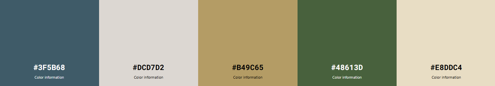

# Anagram Jam

**Anagram Jam** is a site that demonstrates a combination of HTML/CSS & Javascript languages to create a fun word game with anagram puzzles. It is a fast-paced, vocabulary-boosting word game that challenges players to unscramble letters and find all possible valid anagrams. It's easy to pick up but hard to put down — perfect for word lovers, puzzle enthusiasts, and anyone looking to sharpen their brain in a fun and engaging way.

**LINK TO GIT HUB PROJECT BELOW**

[Link to GitHub project](https://tgoss1984.github.io/anagram-game/)

## Table of Contents
- [**Description**](#description)       
    - [User Experience](#user-experience) 
- [**Features**](#features)
    - [Main Features](#main-features)
    - [Features for Future Development](#features-for-future-development)
    - [Design](#design)
- [**Deployment**](#deployment)    
- [**Testing**](#testing)
    - [Browser and Device Testing](#browser-and-device-testing)
    - [HTML Validation](#html-validation)
    - [CSS Validation](#css-validation)
    - [JS Validation](#js-validation)
    - [Lighthouse Tests](#lighthouse-tests)
    - [Solved Bugs](#solved-bugs)
    - [Unfixed Bugs](#unfixed-bugs)    
- [**Technologies Used**](#technologies-used)
    - [Languages](#languages)
    - [Technology](#technology)
- [**Credits**](#credits)
    - [Content Links](#content-links)
    - [Media Links](#media-links)

## Description

### User Experience

Anagram Jam delivers a clean, engaging, and responsive experience designed for players of all ages and skill levels. The intuitive interface presents players with letter tiles in a Scrabble-inspired layout, encouraging them to form real English words through clever thinking and pattern recognition. With difficulty levels ranging from easy to very hard, the game provides a steady learning curve and replayability. Visual feedback such as score tracking, animated tile displays, and clear result indicators enhance user interaction, while accessible design elements like keyboard focus support and mobile responsiveness ensure a seamless experience across all devices.

## Features

### Main Features

- **The Anagram Jam main logo & Heading**
    - Featured at the top of the page,  easy to see for the user and styled like the tiles from the game scrabble to elecit the feeling of playing a word game
    - Due to the fact that the heading was created to look like each letter is a tile, the heading was not built in the traditional way using a 'h1' element

    

- **The Game Area**   
    - Multiple Difficulty Levels: Easy, Medium, Hard, Very Hard for the user to easily pick from
    - Click 'Start Game' for Random Anagram sets: Each game is different
    - Once 'Start Game' has been clicked the puzzle section appears

    

- **The Puzzle Section**
    - Round Counter to let user know which number of round the user is currently in (out of 10)
    - Scrabble-style tiles: Both on the header & the game itself for fun reference to scrabble & some visual engagement with the tiles flipping to reveal the word
    - Enter guess form is where the user can type/input their answer
    - Enter Guess button to submit the answer (the user can also submit by hitting Enter on the keyboard (achieved by using event listener))
    - Score Tracking: Tracks score out of 10 - lets the user see their current/final score

    

- **Feedback Area**
    - Lets the user know whether or not they answered correctly and returns a tick or cross depending on the outcome along with some possible answers if answer provided is incorrect (if incorrect this will also show the user possible answers)

    
    
- **Responsive Design: Suitable to play on destop, tablet & mobile**

#### How to Play?

- Choose a difficulty Level
- After starting game an anagram base word appears using letter tiles
- Type in a valid anagram of that word (not using the base word)
- Get feedback instantly - green circle with tick if correct , red circle with cross if incorrect
- Complete all 10 rounds and see your final score

### Features for future Development
 
 - Timed mode with countdown
 - Leaderboard integration (maybe add database)
 - Accessibility enhancements
 - Sound Effects

### Design

The orignal concept was created using wireframes with the objective being to create a one-page / word game website. Anagram Jam features a clean, inviting interface inspired by classic Scrabble tiles and rich wood‑grain textures, combining modern CSS techniques and thoughtful UX. The colour theme is neutral, parchment‑like color palette (warm creams and muted greens) paired with bold accent hues to highlight interactive elements and scores. Tiles are rendered as flex‑aligned cards with subtle 3D flip animations that reveal each scrambled letter in sequence. The layout is fully responsive—built mobile‑first with CSS Grid and Flexbox—so that controls, feedback messages, and the game board always remain centered and legible on any screen size. Under the hood, CSS custom properties and Google Fonts ensure consistent theming, while semantic HTML5 landmarks and ARIA attributes support keyboard navigation and screen readers. Altogether, the design balances playful visual flair with accessible, user‑focused functionality.

#### Main Colours used

Use of beige, Greens, browns were used to tie in with not only scrabble pieces but also the background image used for the website. The website [Image Color Picker](https://imagecolorpicker.com/) was used to do this

#### Font

Main fonts used were 'Liber Baskerville' & 'Bitter'.
Liber Baskerville was used to give the the traditional word game feel on all headers
Bitter was used for the game area to provide a clean, modern aesthetic

## Deployment

**Used VSCode to build & GitHub for deployment of the website.**

- **VSCode**
    - Code was written in VSCode.
    - html & readme.md were added to the main folder and a sub-folder was created named assests wherein images/css style sheet & Javascipt were kept (css & javascript within their own subfolders within assets folder)

- **GitHub**
    - A GitHub account was created
    - A new reposiory was created on GitHub by clicking the 'New' button. It was named and set as public.  
    - A folder was created in VSCode and initialised as a Git repository
    - In VSCode the terminal was used to run commands to link the local project to the GitHub repository
    - Throughout the process of builing the website, commits & pushes were staged regularly using terminal commands such as 'git add .' , 'git-commit -m' & 'git push'
    - Host the project: Went to my GitHub repository, clicked settings > pages and selected the branch to publish, hit save and then GitHub generated a live link (link at top of readme) 

    The live link can be found here: [Link to GitHub project](https://tgoss1984.github.io/anagram-game/)
    
## Testing

### Browser and Device Testing

[Browserstack](https://www.browserstack.com/?utm_source=bing&utm_medium=cpc&utm_platform=paidads&utm_content=&utm_campaign=Bing-Search-Brand-Tier1-EMEA-CL&utm_campaigncode=BrowserStack-Alpha+41752&utm_term=e+browserstack&msclkid=3d18b644641d13bfb677d1ae33798480) was used to test the site on multiple browsers on desktop and mobile.

| Browser | Device | Outcome of testing? |
|----------|----------|----------|
| Mozilla | Edge Fusion | Responsive/Successful |
| Galaxy S22| Samsung Browser | Responsive/Successful  |
| Iphone 16 | Safari | Responsive/Successful  |
| Ipad Pro | Chrome | Responsive/Successful |
| Windows 11 | Edge | Responsive/Successful |

**Screenshot examples below**

- Edge Fusion / Mozilla

- Galaxy S22 / Samsung Browser

- Iphone 16 / Safari

- Ipad Pro / Chrome

- Windows 11 / Edge

## HTML Validation

Code was validated using HTML Validation 

- [HTML Validator](https://validator.w3.org/#validate_by_input)

## CSS Validation

Code was validated using CSS Validation

- [CSS Validator](https://jigsaw.w3.org/css-validator/)

## JS Validation

Code was validated using JS Hint

- [JS Hint](https://jshint.com/)

### Lighthouse Tests

Lighthouse test results - 

All key scores were passed in lighthouse test

**General Site Testing**

- I checked that the site was fully responsive on multiple screen types using not only browserstack but also devtools device toolbar once deployed to github pages
- I confirmed that the all buttons worked correctly (start game would show the game area), submit would show if the answer was correct/incorrect once deployed to github pages
- I confirmed that the round and score counters worked as expected & that the 'Game Complete' showed once all ten rounds are over with an overall score once deployed to github pages
- Many of the Javascript solved bugs mentioned below were tested using devtools debugger & JSHint
- Checked & tested the dropdown for difficulty selector
- Checked & tested the 'Start Game ' button to ensure the game area appeared & started the game
- Checked & tested the 'Enter Guess' input
- Checked & tested tthat the round counter worked correctly
- Checked and tested that the 'submit' button & Enter key sent the guess correctly
- Checked & tested that the score counter counted correctly
- Checked and tested that the game ended correctly with a final score

### Solved Bugs

- General Bugs
    - There were many occasions when the javascript just did not work as expected and I used JSHint to help with this. The most common errors I found were syntax errors where I had missed the following ; / {} / [] 
    - When testing code in HTML Validator I found some syntax errors in the code, these were fixed and corrected

- Game Logic Bugs:
    - When I was testing the code , intially I didnt include 'usedSets' so this meant that some words would appear twice, this was fixed by adding it to the code
    - Currently when the user types the same base word this gives the message 'That's the base word! Try a different anagram'. This could be seen as confusing or exploitable.
- UI & Flip Animation glitch:
    - Initially I tried to add an extra wrapper element for the tile flip animation, this caused the layout to break, which meant tiles did not wrap properly, this was fixed by ensuring the extra CSS existed in the .tile element
    - Because I was using bootstrap and classes like .row & .d-flex there were sometimes overlaps when used in the wrong places which caused issues with the UX
- Accessibility & Keyboard Bugs:
    - When first testing with Lighthouse I got a lower than expected accessibility score, this was because aria labels had been missed or added incorrectly to certain elements, once fixed the score was much improved
    - When first testing the game I inherently pressed enter to submit an answer, when this did not work I decided that I should implement an event listener for a key press. At first though I did not add the call to checkGuess() which meant that this did not work. Once added this corrected the issue
    - As the game area starts as hidden using display:none, I decided to add a focus() into the JS to ensure better user experience - this was discovered after I first tested the code
- Resource Paths & Deployment errors:
    - When I first deployed the site in gitpages I realised that all images used where not visible, I had to change the image file paths to fix this

### Unfixed Bugs

No unfixed bugs

## Technologies Used

### Languages

**Languages Used**

    - HTML
    - CSS (with Bootstrap)
    - Javascript 

### Technology

    -VSCode
    -GitHub
    
## Credits

- The icons for the tick & cross where taken from [Font Awesome](https://fontawesome.com/)
- The main font used were taken from [Google Fonts](https://fonts.google.com/)
- [Bootstrap](https://getbootstrap.com/) was used in the CSS
- I used [Reddit-JavascriptHelp](https://www.reddit.com/r/JavaScriptHelp/) & [Google Search](https://www.google.com/) to help with some of the javascript code
- Google Images was used
- [Youtube](https://www.youtube.com/) for reference but code was not taken directly from here

    

### Content Links

- [Link to Bootstrap](https://getbootstrap.com/)
- [Link to Google Fonts](https://fonts.google.com/)

### Media Links

- [Link to Font Awesome](https://fontawesome.com/)
- [Link to pngimg](https://pngimg.com/)
- [Link to icons8](https://icons8.com/icons)
- [Link to Image Color Picker](https://imagecolorpicker.com/)
- [Link to Wireframe](https://wireframe.cc/)
- [Link to Techsini](https://techsini.com/multi-mockup/index.php)

## Author

Tom Goss